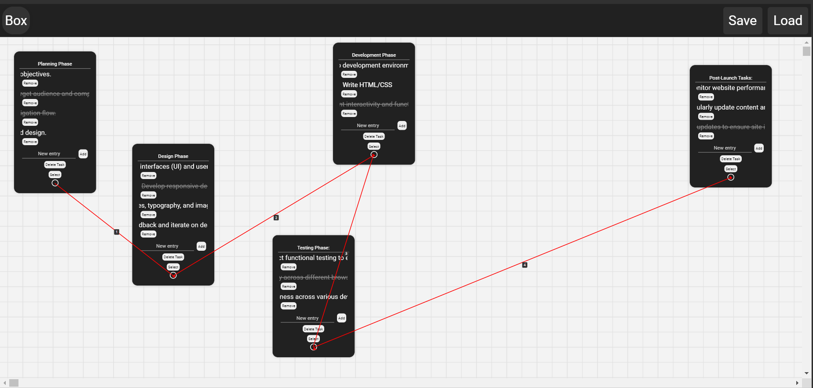

# Interactive Task Visualization Application

## Overview

This dynamic, web-based application offers an intuitive and visually engaging way to manage tasks, ideas, and workflows. Inspired by modern game development environments, it provides a canvas-like interface where users can create, connect, and manipulate task nodes in a tree-like structure.



## Key Features

- **Node-Based Task Creation**: Spawn task nodes with customizable shapes and properties.
- **Dynamic Connections**: Create visual links between tasks to represent relationships or dependencies.
- **Interactive Canvas**: Zoom, pan, and navigate through your task ecosystem with ease.
- **Real-Time Editing**: Modify task details on the fly with seamless updates.
- **Engaging UI Elements**: 
  - Typewriter effect for displaying motivational messages
  - Smooth animations for a polished user experience
- **Responsive Design**: Adapts to various screen sizes, from desktop to mobile devices.
- **Persistence**: Save and load your task structures for continued work across sessions.

## Technical Highlights

- **HTML5 Canvas**: Leverages canvas for high-performance rendering of nodes and connections.
- **CSS3 Animations**: Implements fluid transitions and visual effects.
- **Vanilla JavaScript**: Core functionality built with pure JavaScript for optimal performance.
- **Local Storage API**: Utilizes browser's local storage for saving and loading projects.
- **SVG Integration**: Incorporates Scalable Vector Graphics for crisp, resizable UI elements.
- **Touch-Enabled**: Supports multi-touch gestures for mobile and tablet interactions.

## Getting Started

1. Clone the repository:
   ```
   git clone https://github.com/liwa-dev/task-management.git
   ```
2. Open `index.html` in a modern web browser.

## Usage Guide

- **Create a Node**: Click the "Box" button in the top-left corner.
- **Move Nodes**: Click and drag to reposition.
- **Edit Node Content**: Click on a node to modify its title or add entries.
- **Create Connections**: Select one node, then another to establish a visual link.
- **Navigate the Canvas**: 
  - Zoom: Use mouse wheel or pinch gesture
  - Pan: Click and drag on the background
- **Save/Load**: Use dedicated buttons to persist or retrieve your work.

## Customization

Tailor the application by modifying these key files:
- `style.css`: Adjust visual styles and animations
- `script.js`: Extend core functionality and interactions
- `index.html`: Modify structure or introduce new elements

## Browser Support

Optimized for modern web browsers including:
- Google Chrome (recommended)
- Mozilla Firefox
- Safari
- Microsoft Edge

## Contributing

We welcome contributions! Feel free to fork the project and submit pull requests.

## License

This project is open source and available under the [MIT License](LICENSE).

## Acknowledgements

- Inspired by node-based interfaces in game development and visual programming environments.
- Background patterns and UI elements crafted to enhance user focus and creativity.

---

For questions, feedback, or support, please open an issue in the GitHub repository.
